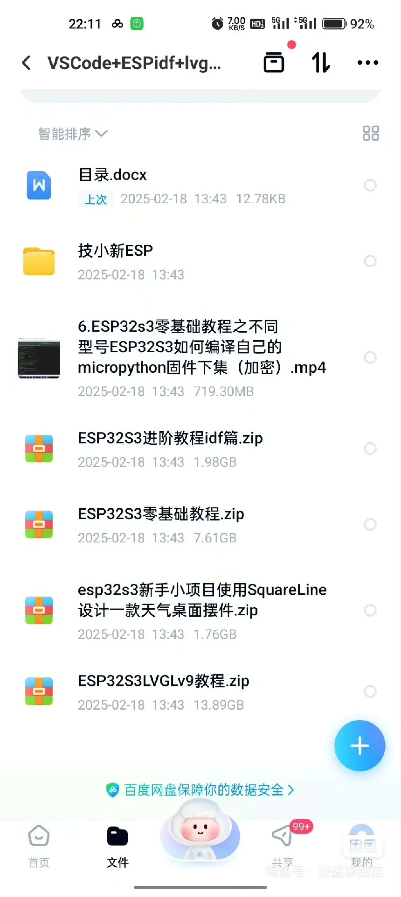
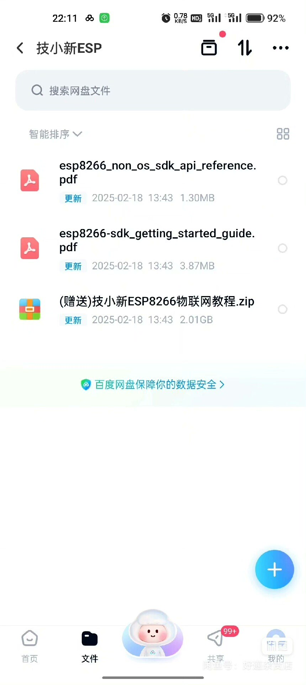
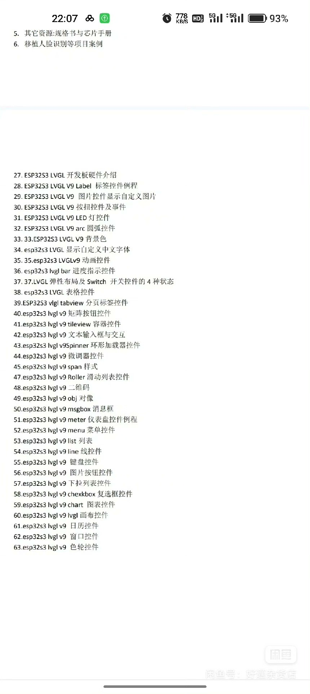

# 1. Understanding the Basic Concepts of ESP32S3: Firstly, you need to understand the basic concepts of ESP32S3, including its hardware architecture, software architecture, and connection methods with other devices. This will help you better understand the subsequent learning content.

## Body

ESP32S3 Beginner to Advanced Video Tutorial, LVGL Library Migration Guide

(Full product description was not available from the source page.)

## Images

## Payment

Here is a pay link on Stripe ( https://buy.stripe.com/3cs8yP7sY87d0vu9AB ). Please contact me lonlonago@foxmail.com after funding $89, and I will send you a complete data files , thank you!

